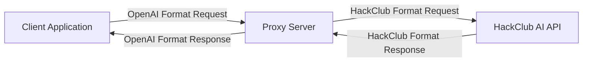

# HackClub API Compatibility Layer

An OpenAI API-compatible proxy for HackClub AI that allows you to use OpenAI clients with HackClub's free AI service.

## How It Works

This proxy server acts as a middleware between your application and HackClub's AI service, translating requests and responses between OpenAI's API format and HackClub's API format.



## API Endpoints

- `GET /models` - Get list of available models (OpenAI compatible endpoint)
- `GET /v1/models` - Get list of available models (OpenAI v1 compatible endpoint)
- `POST /chat/completions` - Create chat completions (main endpoint)
- `POST /v1/chat/completions` - Create chat completions (OpenAI v1 compatible endpoint)
- `GET /test-response` - Return a test response to check client compatibility

## Getting Started

### Local Development

1. Clone the repository
2. Install dependencies:
   ```
   npm install
   ```
3. Start the server:
   ```
   npm start
   ```
4. Visit `http://localhost:3000` for Swagger UI documentation

### Vercel Deployment

This project is ready to deploy to Vercel:

1. Fork this repository
2. Connect it to your Vercel account
3. Deploy

The `vercel.json` file is already configured for serverless deployment.

## Usage Example

Using fetch:

```javascript
fetch('https://ai.minoa.cat/chat/completions', {
  method: 'POST',
  headers: {
    'Content-Type': 'application/json',
  },
  body: JSON.stringify({
    messages: [
      {
        role: 'user',
        content: 'Tell me a joke!'
      }
    ]
  })
})
.then(response => response.json())
.then(data => console.log(data));
```

Using OpenAI's Node.js client:

```javascript
import OpenAI from 'openai';

const openai = new OpenAI({
  baseURL: 'https://ai.minoa.cat',
  apiKey: 'dummy-key' // API key is ignored but required by the client
});

async function main() {
  const completion = await openai.chat.completions.create({
    messages: [{ role: 'user', content: 'Tell me a joke!' }],
  });

  console.log(completion.choices[0].message.content);
}

main();
```

## Important Notes

- HackClub AI's service is for non-commercial, educational purposes only
- The proxy doesn't add any authentication - it's just as open as HackClub's API
- The actual model used is dynamically detected from HackClub's homepage

## License

This project is licensed under the terms of the LICENSE file included in this repository.

## Credits

- Powered by [ai.hackclub.com](https://ai.hackclub.com)
- Created by [minoa.cat](https://bio.minoa.cat)
